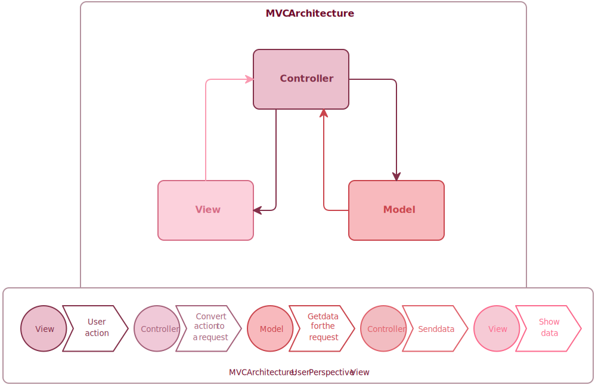

# All About the Model-View-Controller
A short rambling about the Model-View-Controller(MVC).

## What it is:

The MVC allows an engineer to encapsulate different aspects of their project. You could always just throw all of your code into one file or a single folder, then call it a day. However, that can lead to many issues.

Think of it like this. It would really suck if your apartment flooded. Everything's wet. The roomba's ruined. Your cat's mad. Terrible. However, life goes on as normal for every other resident.

Think of the building like your project. If everyone lived in one big room, that flood leads to frustration for everyone. 
That's why using the MVC can be so beneficial. The MVC allows you to structure your project into different sections to avoid issues that wreck the whole project. Let's take a deep dive into what the MVC has to offer.

More rambling here...

<!-- 

This is a work in progress. 

 -->
