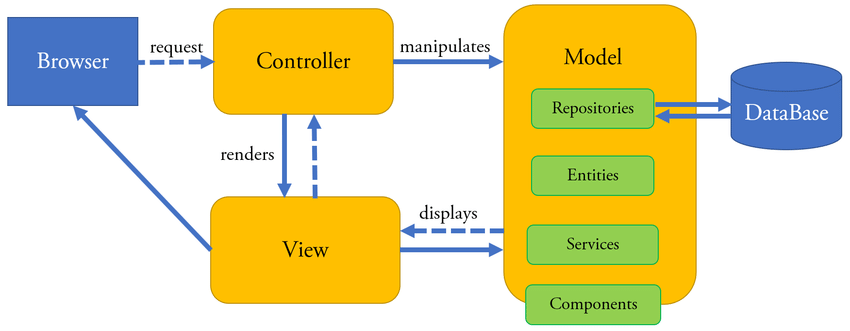

# All About the Model-View-Controller
A short rambling about the Model-View-Controller(MVC).

## What it is:

NOTE: If you are reading this, it's assumed you have an understanding of Node, Express and Mongoose.

The MVC allows an engineer to encapsulate different aspects of their project. You could always just throw all of your code into one file or a single folder, then call it a day. However, that can lead to many issues.

Think of it like this. It would really suck if your apartment flooded. Everything's wet. The roomba's ruined. Your cat's mad. Terrible. However, life goes on as normal for every other resident.

Think of the building like your project. If everyone lived in one big room, that flood leads to frustration for everyone. 
That's why using the MVC can be so beneficial. The MVC allows you to structure your project into different sections to avoid issues that wreck the whole project. Let's take a deep dive into what the MVC has to offer.



In the image above, we can see the different parts of the MVC. We'll  take a look at each of them now.

## Controller

The controller is typically the first part of the MVC that the browser and user will interact with. A user would send a request to the server, then the controller would decide what happens with that request As you can see, the controller could render a view and send it back to the browser. It could be a simple GET request which, when sent to the controller, will render the page associated with that route. Here's an example:

```javascript
const Todo = require('../models/Todo')

module.exports = {
    getTodos: async (req,res)=>{
        try{
            const todoItems = await Todo.find()
            const itemsLeft = await Todo.countDocuments({completed: false})
            res.render('todos.ejs', {todos: todoItems, left: itemsLeft})
        }catch(err){
            console.log(err)
        }
    },

    // ...
}
```


<!-- 

This is a work in progress. 

 -->
